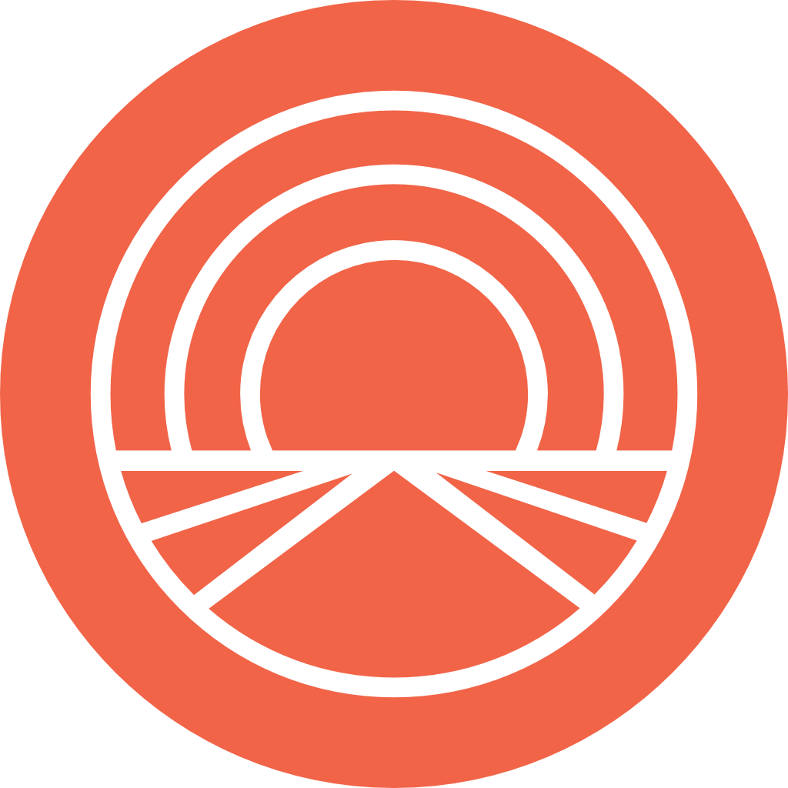

### Applied Reinforcement Learning @ Facebook

---

#### Overview
Horizon is an open source end-to-end platform for applied reinforcement learning (RL) developed and used at Facebook. Horizon is built in Python and uses PyTorch for modeling and training and Caffe2 for model serving. The platform contains workflows to train popular deep RL algorithms and includes data preprocessing, feature transformation, distributed training, counterfactual policy evaluation, and optimized serving. For more detailed information about Horizon see the white paper [here](https://research.fb.com/publications/horizon-facebooks-open-source-applied-reinforcement-learning-platform/).

#### Algorithms Supported
- Discrete-Action [DQN](https://storage.googleapis.com/deepmind-media/dqn/DQNNaturePaper.pdf)
- Parametric-Action DQN
- [Double DQN](https://arxiv.org/abs/1509.06461), [Dueling DQN](https://arxiv.org/abs/1511.06581), [Dueling Double DQN](https://arxiv.org/abs/1710.02298)
- [DDPG](https://arxiv.org/abs/1509.02971) (DDPG)
- [Soft Actor-Critic](https://arxiv.org/abs/1801.01290) (SAC)

#### Installation
Horizon can be installed via. Docker or manually. Detailed instructions on how to install Horizon can be found [here](docs/installation.rst).

#### Usage
Detailed instructions on how to use Horizon can be found [here](docs/usage.rst).

#### License
Horizon is released under a BSD license.  Find out more about it [here](LICENSE).

#### Citing
@article{gauci2018horizon,
  title={Horizon: Facebook's Open Source Applied Reinforcement Learning Platform},
  author={Gauci, Jason and Conti, Edoardo and Liang, Yitao and Virochsiri, Kittipat and Chen, Zhengxing and He, Yuchen and Kaden, Zachary and Narayanan, Vivek and Ye, Xiaohui},
  journal={arXiv preprint arXiv:1811.00260},
  year={2018}
}

